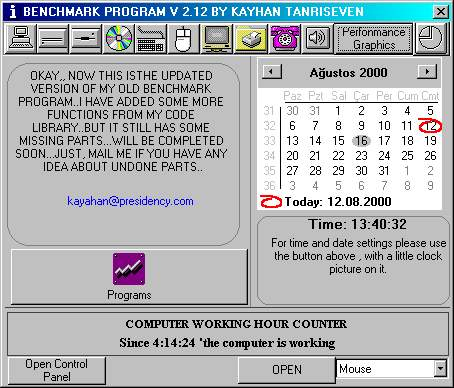



## BenchmarkV\.2

### Description

Hey..I updated my previous submission of Benchmark program and cleaned up some bugs...I also added some more cool functions to it, however there still some missing parts that will be ready soon...AND FOR ALL YOU...I AM REALLY SORRY FOR ACTIVEX DLL ERRORS..JUST FIXED THEM...YOU CAN RE-DOWNLOAD NOW..!!
 
### More Info
 

             |
---                |---
**Submitted On**   |2000-08-18 12:19:42
**By**             |[VbNick](https://github.com/Planet-Source-Code/PSCIndex/blob/master/ByAuthor/vbnick.md)
**Level**          |Advanced
**User Rating**    |5.0 (10 globes from 2 users)
**Compatibility**  |VB 5\.0, VB 6\.0
**Category**       |[Complete Applications](https://github.com/Planet-Source-Code/PSCIndex/blob/master/ByCategory/complete-applications__1-27.md)
**World**          |[Visual Basic](https://github.com/Planet-Source-Code/PSCIndex/blob/master/ByWorld/visual-basic.md)
**Archive File**   |[CODE\_UPLOAD99189152000\.zip](https://github.com/Planet-Source-Code/vbnick-benchmarkv-2__1-11494/archive/master.zip)

### API Declarations

you can see them in the project..

